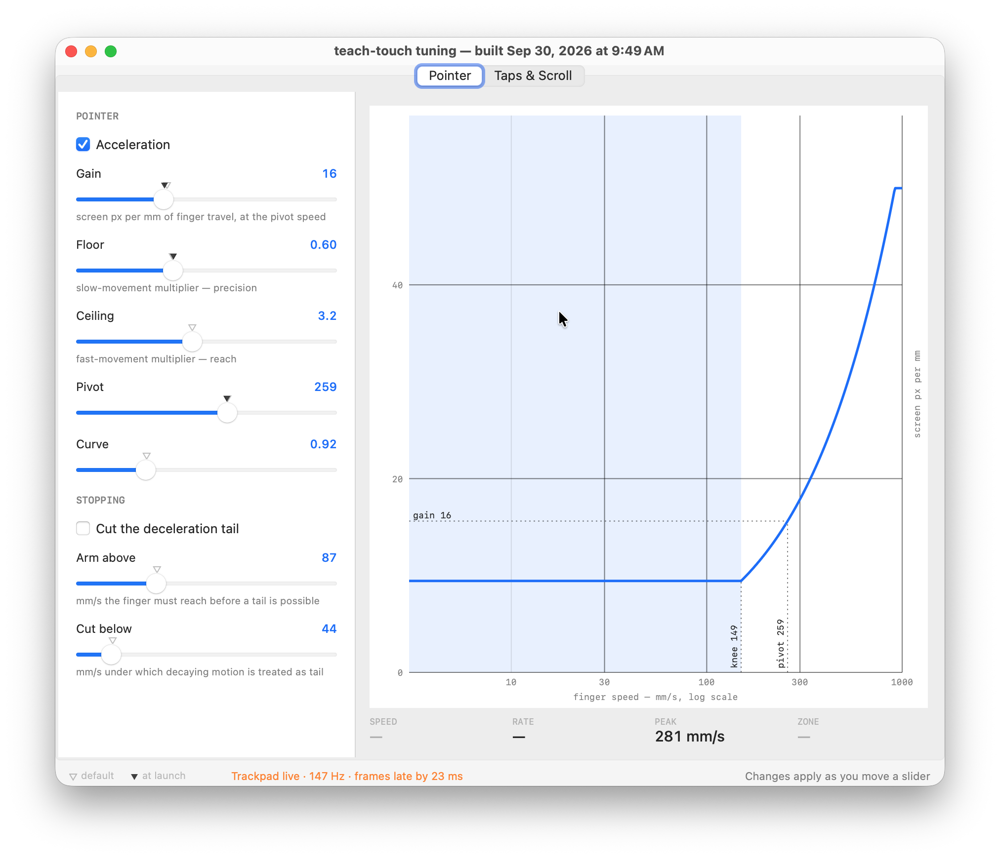

# kneepad

An unofficial userland driver for the ZSA Navigator trackpad on macOS. It is built around a custom pointer acceleration curve.

## Why

I made kneepad to solve this problem: How can I make the pointer feel like an extension of my mind?

My point of reference is Apple's trackpad. The hardware is excellent, and the out of box software tuning is great. The combination of the two creates the "extension of my mind experience".

The ZSA Navigator hardware is excellent. It's accurate, the surface feels good. But, the software out there is lacking. I've tested ZSA Navigator Companion App, SteerMouse, MacOS vanilla mouse settings. All of these had the same issue: At every combination of pointer speed/acceleration, the pointer was too twitchy at slow speeds or too slow at high speeds. No single value gave me both.

I wanted two behaviors: a constant, predictable speed when I move slow, and acceleration when I move fast. The speed curve looks like a "knee cap" or "hockey stick".

The value proposition of kneepad is to let me create this acceleration profile. The shape of the curve is personal preference. The defaults are tuned for me, and you can tune it yourself.

## The knee

The knee is the finger speed where the curve changes from the constant zone to the acceleration zone.

Below the knee, the pointer moves the same distance for each millimeter of finger travel, at any speed. This zone is for aiming. Your hand learns one distance, and the pointer does not jump when you speed up a little.

Above the knee, the speed changes. The faster you move, the further each millimeter takes the pointer. This zone is for moving across the screen. The curve climbs gradually and stops at a ceiling.

The app shows the curve as you tune it. The shaded area is the constant zone, and the dotted line marks the knee. When you move a slider, the curve and the pointer change at the same time, so you can feel each change as you make it.

<!-- VIDEO: on github.com, edit this file and drag docs/demo.mp4 onto this line. GitHub replaces it with a user-attachments URL that plays inline. -->



You set the curve with five sliders:

| Slider | Default | What it does |
|---|---|---|
| Gain | 16 | Screen pixels per millimeter of finger travel, at the pivot speed. |
| Floor | 0.60 | The multiplier for slow movement. It sets the height of the constant zone. A lower value gives more precision. |
| Ceiling | 3.2 | The largest multiplier for fast movement. A higher value gives more reach. |
| Pivot | 260 mm/s | The finger speed where the multiplier is exactly 1. It moves the knee. |
| Curve | 0.92 | How steeply the curve climbs above the knee. |

The floor and the pivot together set the knee. With the defaults, the knee is at about 149 mm/s, and the curve reaches the ceiling at about 920 mm/s.

The app saves your values in `~/Library/Application Support/teach-touch/tuning.json`.

Key Tuning Advice: Identify the finger speed cutoff for precise actions. Move your finger left/right across the trackpad at the speed you'd use for precise pointers. Look at the graph and see where the cluster sits. This is the pointer speed where you want the *knee* to sit. Once you've identified your "knee" position, tune the other options to preserve this knee position.

## Requirements

- macOS 13 or later.
- Swift 5.9 or later, from Xcode or the Xcode Command Line Tools.
- A ZSA Voyager with the Navigator trackpad.

## Install

kneepad installs from source. The pad works only while the app is open. When you quit the app, the pad goes back to its normal mouse mode.

1. Optional: run `./scripts/create-signing-identity.sh` one time. It creates a local signing identity, so that macOS keeps its permissions for kneepad after each rebuild. If you skip this step, macOS asks for the permissions again after every build.
2. Run `./scripts/build-app.sh`. The script builds `build/Kneepad.app`.
3. Run `open build/Kneepad.app`.
4. In System Settings > Privacy & Security > Input Monitoring, allow Kneepad. Then quit the app and open it again.
5. In System Settings > Privacy & Security > Accessibility, allow Kneepad.

If you move the app to `/Applications`, give the permissions to that copy. macOS gives permissions to one copy of an app, not to all copies.

## If the pointer stops working

If the app stops and the pad does not move the pointer, run this command from the repository folder:

```
swift run hid-stream --restore
```

The command puts the pad back into mouse mode.

## How it works

kneepad runs as a normal app, with no kernel extension and no DriverKit driver. It opens the trackpad through IOHIDManager and switches the pad from mouse mode to multitouch mode. Then it reads the raw finger positions and posts its own pointer, click, and scroll events.

## (No) Support

I published so that other people can try it and change it. I do not give support. Everything other than the acceleration curve is hacked together. If you want it to work differently, fork it and change it.

I have no expertise in Swift, MacOS APIs, the USB Driver stack, hardware, nor touch device algorithms. All of the code was written by AI Claude, iteratively over several weekends. See [`plan/README.md`](plan/README.md) for the initial design logs.

## License

0BSD. See [`LICENSE`](LICENSE).

Built with Claude Code.
